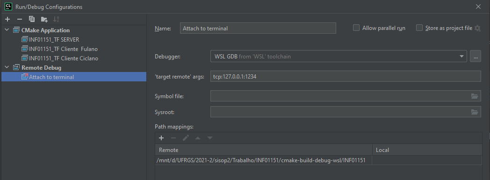

# INF01151
INF01151 – SISTEMAS OPERACIONAIS II N


## Compiling source code

### 1º Create the build directory
```bash 
mkdir build
```
### 2º execute cmake
```bash 
cmake -S . -B build
```
### 3º Compile the generated Makefile
```bash 
make -C build
```

## Running the server
```bash 
./build/INF01151 -s
```
## Running one client
```bash 
./build/INF01151 -c -u a_user_name
```

### Optional Arguments
#### Server and Client can run in a specific port using the args -p \<port number\>
#### eg:
```bash
./build/INF01151 -s -p 1151 
./build/INF01151 -c -u user_a -p 1151
./build/INF01151 -c -u user_b -p 1151
```

## Debuging with gbd and Clion
### run the GDB server
```bash
gdbserver localhost:1234 ./INF01151 -c -u patrick -d
```
### On Clion Attach to it


